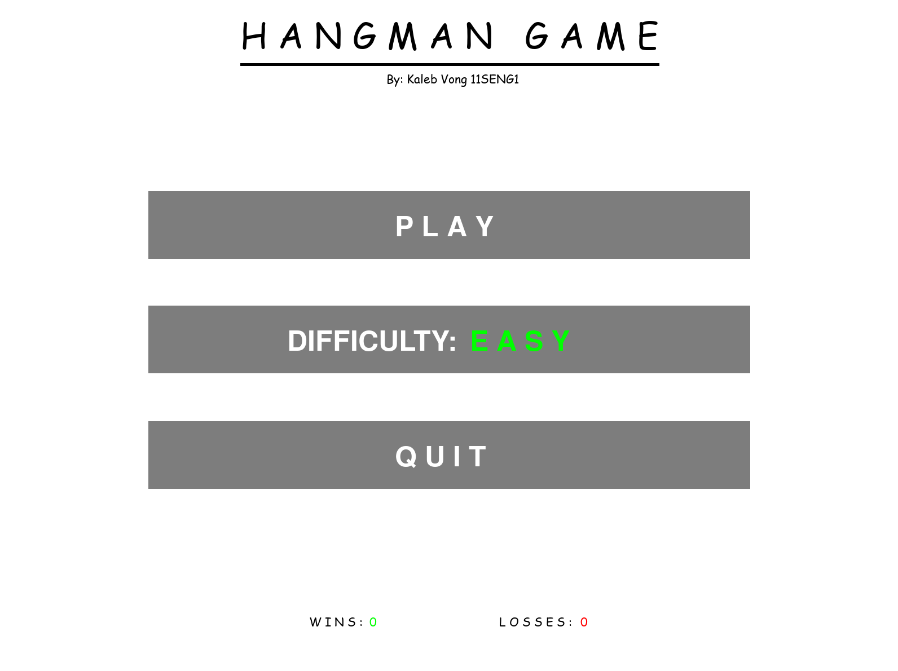
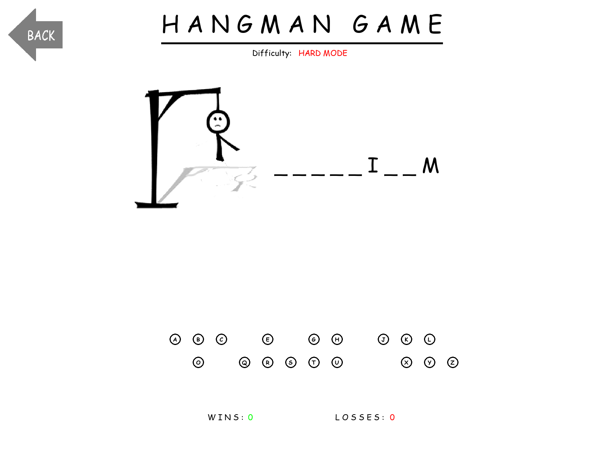

# Hangman-Assessment-Task-1
A fun, educational and interactive take on the classic Hangman game with adjustable difficulty levels, built with only Python and Pygame. Coded singlehandedly by Kaleb Vong 11SENG1 with help from trusted online tutorials from [Tech With Tim](https://www.youtube.com/@TechWithTim).

## Features
- 3 distinct difficulty levels (EASY, MEDIUM, HARD)
- Over 45 different words each custom to word lists based on difficulty
- Fully fledged and designed start menu
- Easily understandable User Interfaces
- Supports fullscreen mode for most immersive gameplay

## Installation Guide
### Prerequisites
- Visual Studio Code (version 1.96.x or higher)
- Python (version 3.x or higher) and PIP (version 25.x or higher)
- Pygame library needs to be installed within downloaded workspace (Hangman-Assessment-Task-1 **folder**).
  -    To install: run the command "pip install pygame" in terminal or cmd from workspace directory. If prompted to create a virtual environment by VS code, click "Yes."
 
### Step-by-Step Installation
1. Click the green "Code" button on GitHub page and click "Download ZIP"
2. Navigate to "Hangman-Assessment-Task-1-main.zip" and open file
3. Drag and drop "Hangman-Assessment-Task-1-main" **folder** to anywhere of your choosing
4. Open **Visual Studio Code** and click "File" in top-left corner
5. Click "Open Folder" in drop-down menu
6. Navigate to Folder previously extracted from ZIP file, select it and click "Select Folder"
7. Navigate to "main.py" file with left-hand sidebar
8. Click arrow button on top-right corner of screen.
   - If all steps completed correctly and all prerequisites have been installed, the game will open.

### How to play
1. Select difficulty of your choosing by clicking difficulty button on main menu
2. Click Play button to begin a game
3. Click letter buttons on the bottom of the screen to start guessing letters of random word
   - Each correct guess will show the letter on screen
   - Each incorrect guess will slowly draw the Hangman
4. Win by guessing all the letters of the word before the Hangman completes drawing!

## Screenshots
 

## Technologies Used
- **Python** 🐍  
- **Pygame** 🎮  
